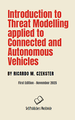
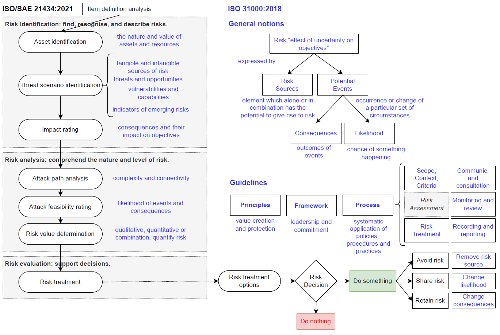

# Book: Introduction to Threat Modelling applied to Connected and Autonomous Vehicles

**Release date:** 04/November/2025

**Author:** Ricardo M. Czekster

**Publisher:** Self Publishers Worldwide

**Abstract:** "This book offers a gentle introduction to Threat Modelling (TM) Connected and Autonomous Vehicles (CAV). It discusses the underpinnings of cybersecurity, and explains what is meant by TM in automotive contexts. The manuscript offers an overview of techniques, approaches, and examples of TM in CAVs, outlining vulnerabilities, modelling decisions, standardisation, and compliance."

# Contributions
One remarkable thing that the book unveils is the relationship between standards namely ISO 31000:2018 and ISO/SAE 21434:2021: in blue, there is some ISO 31000:2018 definitions, showcasing that they share a lot of principles altogether.

# License
The book is under Creative Commons (CC BY 4.0).

Feel free to use it and attribute the original source.

DOI Link: [10.6084/m9.figshare.30529874](https://dx.doi.org/10.6084/m9.figshare.30529874)

# Contact
Reach me at rczekster at gmail
